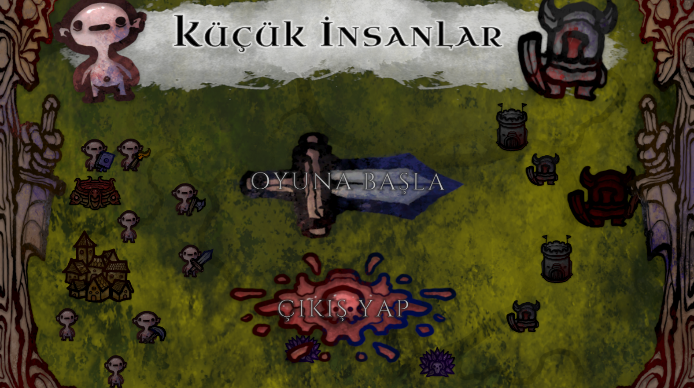
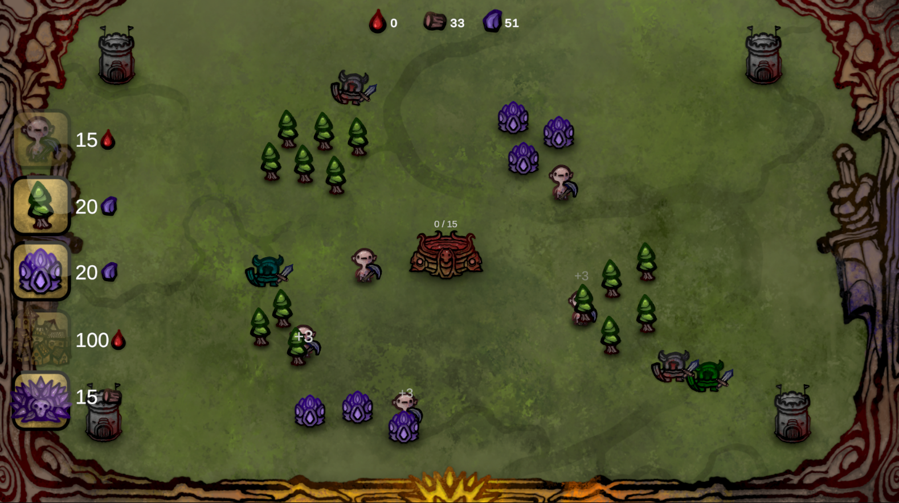
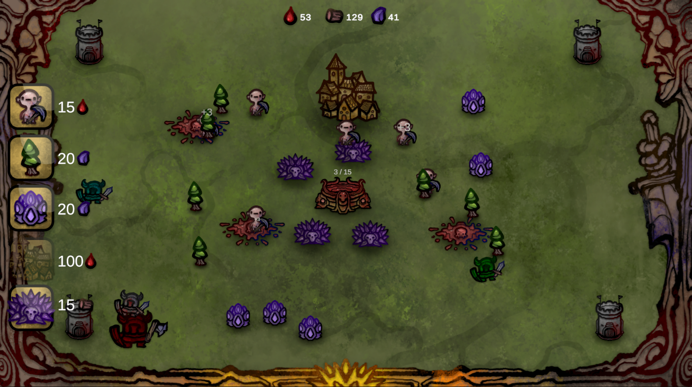

# 2D Top-Down Strategy Practice Game

_Made and Tested with **Unity 6000.1.3f1**_

---
This repository contains a complete 2D fast-paced real-time-strategy game project built with C# and Unity. 

The project was created as a practice and learning exercise to explore Unity fundamentals.

This project was created by following the [Blackthornprod's Launchpad Course](https://www.gamedevrocket.com/launchpad). Special thanks to Blackthornprod for providing clear and helpful guidance for beginners.

## Screenshots

*Main Menu*

---

*Ingame Screenshot*

---

*Ingame Screenshot*

---
